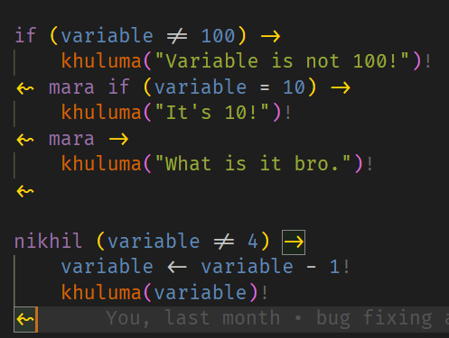
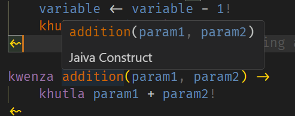
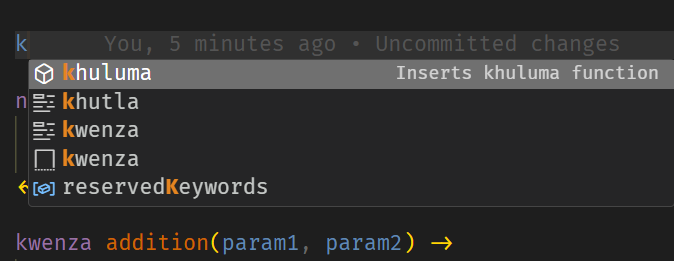

# Jaiva! Editor Integration VSCode Extension

This extension provides basic language support and features for `.jiv`, `.jaiva`, `.jva` file extensions!

## Features

-   **Syntax Highlighting:**  
    Full support for Jaiva syntax with accurate grammar rules.

-   **Code Snippets:**  
    Provides useful snippets for variable declarations, function definitions, loops, conditionals, and more.

-   **Autocomplete:**  
    Intelligent suggestions for variables, functions, and keywords with context‑aware hints.

-   **Run Command:**  
    An integrated "Run" button and CLI command that executes the current file, with customizable arguments from the settings.

## Requirements

You have to have the `jaiva` global command installed by following [Install.md](../../Install.md) ([Github link](https://github.com/yetnt/jaiva/blob/main/Install.md))

## Usage

-   **Editing:**  
    Open a Jaiva file (file extensions: `.jiv`, `.jaiva`, `.jva`) to see syntax highlighting and autocomplete features in action.

-   **Running Code:**  
    Use the `"Run Jaiva"` button in the editor title or execute the command:
    ```sh
    jaiva <current filepath> (additional args)
    ```
    Set additional arguments via the VS Code settings under `jaiva.runArgs`.

## Screenshots

### Syntax Highlighting



### Hover info



### Autocomplete and Snippets



## Extension Settings

This extension contributes the following settings:

-   `jaiva.enable`: Enable/disable this extension.
-   `jaiva.runArgs`: Additional arguments that will be passed to the Jaiva CLI when running a file.

## Known Issues

1. Arrays show the first element in hovers. why idk.

## Release Notes

(MAJOR version is dependant on the current MAJOR version of Jaiva)

### 1.0.0

Initial release of this extension.

## 2.0.0

-   Add support for `tsea` keyword
-   Match new token types for Jaiva release 1.0.0
-   Fix some operators finally.

---
