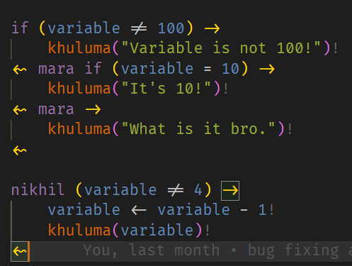
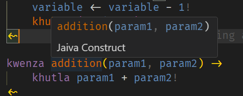
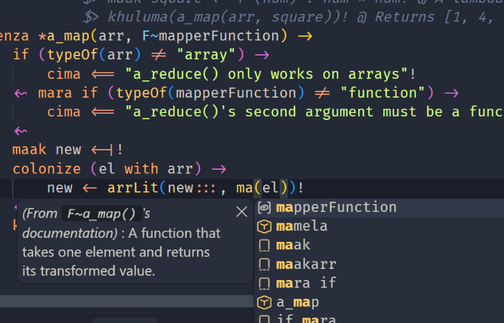
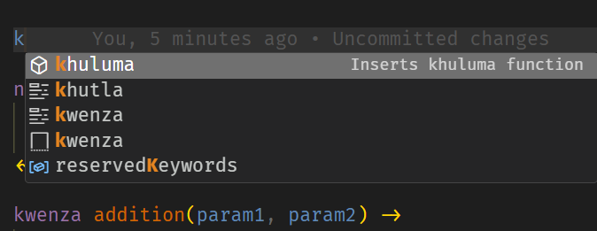
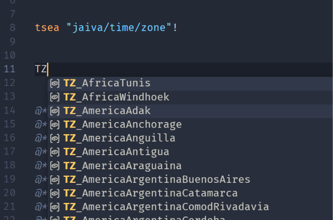
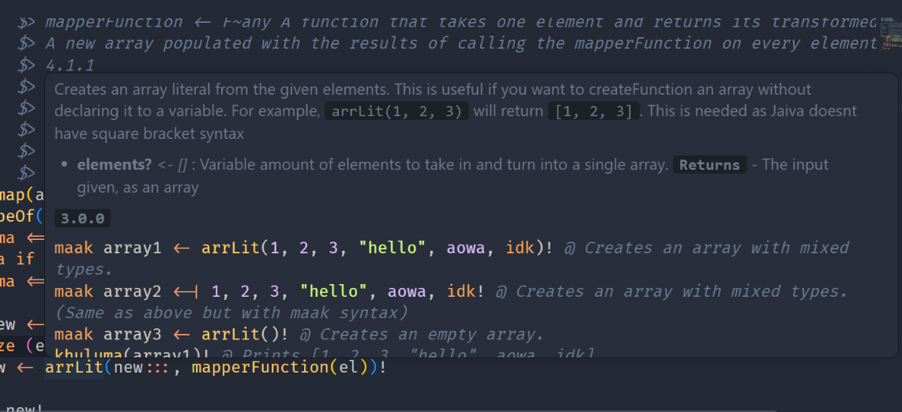
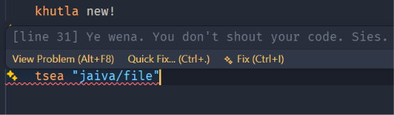

# Jaiva! Editor Integration VSCode Extension

This extension provides basic language support and features for `.jiv`, `.jaiva`, `.jva` file extensions!

## Features

- **Syntax Highlighting:**  
  Full support for Jaiva syntax with da grammar rules.

- **Code Snippets:**  
  Provides useful snippets for variable declarations, function definitions, loops, conditionals, and alot more.

- **Autocomplete:**  
  Suggestions for variables, functions, and keywords with context‑aware hints.

- **Documentation:**
  Hover documentation for built in files and current files (provided you use JDoc)

- **Run Command:**  
  An integrated "Run" button and CLI command that executes the current file, with customizable arguments from the settings.

## Requirements

You have to have the `jaiva` global command installed by following [Install.md](../../Install.md) ([Github link](https://github.com/yetnt/jaiva/blob/main/Install.md))

## Usage

- **Editing:**  
  Open a Jaiva file (file extensions: `.jiv`, `.jaiva`, `.jva`) to see syntax highlighting and autocomplete features in action.

- **Running Code:**  
  Use the `"Run Jaiva"` button in the editor title or execute the command:
    ```sh
    jaiva <current filepath> (additional args)
    ```

## Screenshots

### Syntax Highlighting



### Hover info





### Autocomplete and Snippets





### Docs



### Tokenization Errors



## Extension Settings

This extension contributes the following settings:

- `jaiva.enable`: Enable/disable this extension.

## Known Issues

1. Lambdas dont show their arguments as tooltips
2. Chaai blocks error scoping is broken as hell
